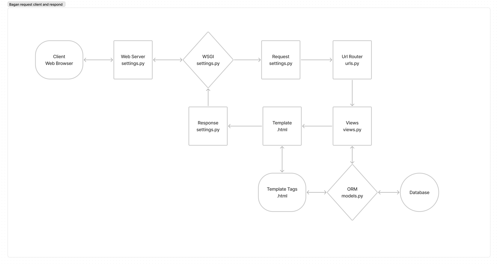
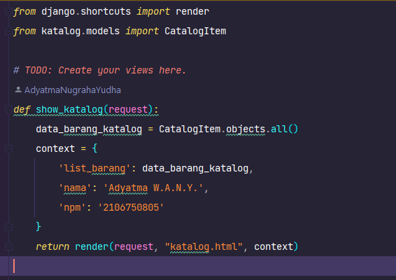
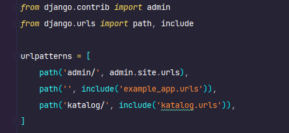
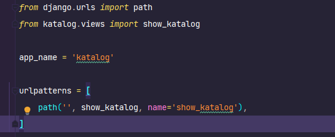
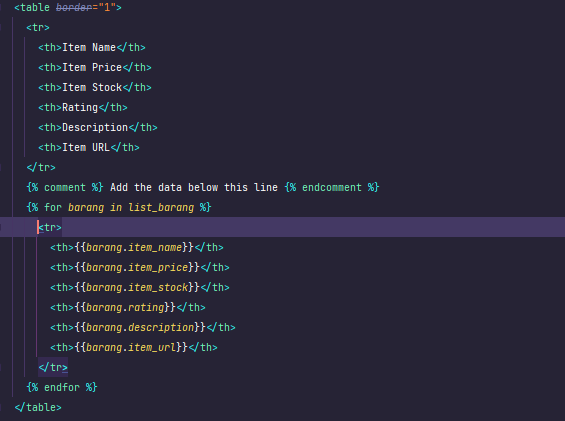

PBP Tugas 2
===========
### Adyatma Wijaksara Aryaputra Nugraha Yudha - 2106750805
### [Home Page](https://pbp-tugas2-adyatma.herokuapp.com/) | [Catalog Page](https://pbp-tugas2-adyatma.herokuapp.com/katalog/)

Bagan Request Client dan Response - Django
------------------------------------------

1. Client mengirimkan request melalui web browser
2. Request diterima dan diproses oleh web server (Web server yang digunakan tugas ini gunicorn)
3. Middleware akan menjembatani hasil proses dari web server dengan dengan urls.py 
4. urls.py sebagai url router akan memproses request dan mengarahkan ke view yang sesuai dengan request client
5. views.py akan memproses request dengan cara menyusun apa yang akan ditampilkan oleh template menggunakan data yang disusun oleh models.py sebagai ORM dan diambil dari database
6. File template .html akan menampilkan hasil dari views.py berdasarkan template tags
7. Middleware akan menjembatani hasil .html yang sudah diisi oleh views.py
8. Web server akan mengirimkan response hasil .html ke client
9. Client menerima hasil .html dan menampilkan ke web browser

Mengapa menggunakan virtual environment?
------------------------------------------
Penggunaan virtual environment bermanfaat untuk memisahkan antara project yang sedang dikerjakan dengan project yang lain. Dengan menggunakan virtual environment, kita dapat menginstall library yang dibutuhkan oleh project tanpa harus menginstall library yang dibutuhkan oleh project lain. Hal ini juga berlaku sebaliknya, jika kita ingin menginstall library yang dibutuhkan oleh project lain, kita tidak perlu menginstall library yang dibutuhkan oleh project yang sedang dikerjakan. Hal ini juga berlaku untuk library yang memiliki versi yang beda, namun memiliki fungsi sama. Dengan menggunakan virtual environment, kita dapat menginstall satu library dengan versi yang beberbeda-beda sesuai dengan dependency dari project yang dikerjakan.

Apakah bisa membuat aplikasi web berbasis django tanpa menggunakan virtual environtment?
----------------------------------------------------------------------------------------
Aplikasi masih bisa dibuat tanpa virtual environment, namun hal ini tidak disarankan karena akan menyebabkan terjadinya konflik antara library yang dibutuhkan oleh project yang sedang dikerjakan dengan library yang dibutuhkan oleh project lain karena library akan terinstall secara global.

Cara implementasi
-----------------
#### 1. Membuat sebuah fungsi pada views.py yang dapat melakukan pengambilan data dari model dan dikembalikan ke dalam sebuah HTML.

Membuat fungsi show_katalog pada views.py untuk mengatur apa yang akan ditampilkan oleh template file .html berdasar data dari database

#### 2. Membuat sebuah routing untuk memetakan fungsi yang telah kamu buat pada views.py.

Membuat path pada urls.py untuk mengarahkan ke urls.py pada katalog

Membuat path pada urls.py untuk mengarahkan ke fungsi show_katalog pada views.py

#### 3. Memetakan data yang didapatkan ke dalam HTML dengan sintaks dari Django untuk pemetaan data template.

Menggunakan for loop Django untuk menampilkan data ke dalam template .html

#### 4. Melakukan deployment ke Heroku terhadap aplikasi yang sudah kamu buat sehingga nantinya dapat diakses oleh teman-temanmu melalui Internet.
1. Membuat app baru di Heroku
2. Merubah isi dpl.yml dengan mengganti nama app Heroku dan api key Heroku
3. Push file-file tugas ke dalam repository Github
4. Tambah repository secret di Github dengan nama HEROKU_API_KEY dan isi dengan api key Heroku dan nama HEROKU_APP_NAME dan isi dengan nama app Heroku
5. Akan secara otomatis di deploy ke Heroku
